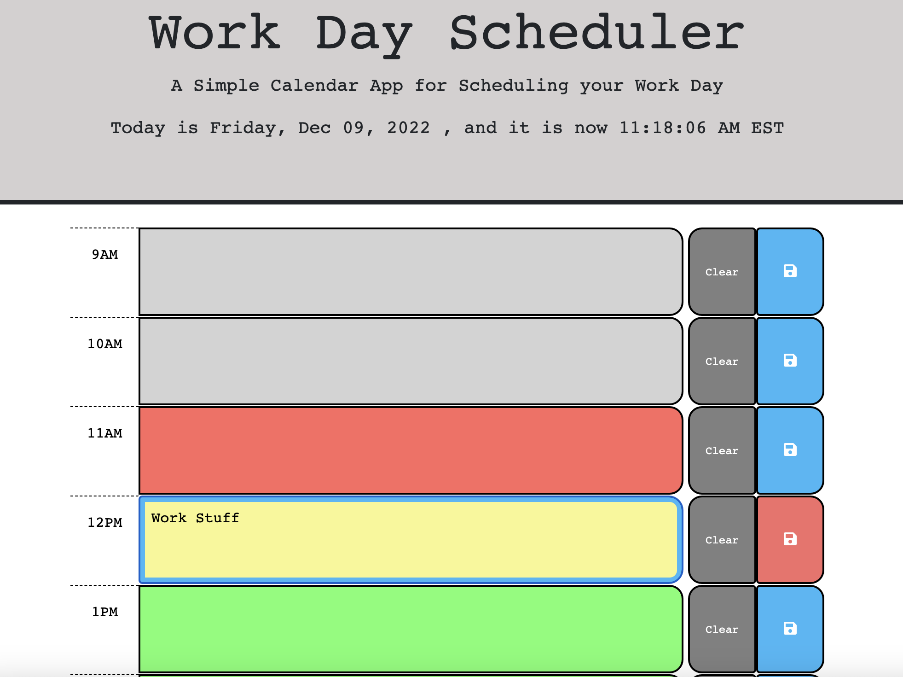

# Challenge 5: Word Day Scheduler

## Description

This is a simple and useful App for users to plan their daily schedule at work. 
At the top there's a clock to remind the users of the time that I created by using third-party API (dayjs).

The main body of the App consists of nine time slots for the users to click on and type in their planned tasks
for each work hour. When they start typing into a text box, the save button next to that text box will start blinking, reminding the users to save the data when done (this will save their entry in their local storage). They are also given a Clear button to click on if they wish to start over on that text box (which will clear the local storage data on the text box).

The text boxes are color-coded to reflect the hour of the day: upcoming hours are green, 
past hours are grey, and the current hour is red.

The page refreshes automatically on the hour to reflect the correct color-coding. To prevent the users from losing
entered data while the page is being reloaded, I inserted an automatic save function for all the text box, which is triggered and executed right before the page reloads so that users can resume typing afterwards without data loss. I've also inserted a countdown sound effect to alert the users that they're moving onto the next hour and the page is about to refresh.

The URL of the deployed, refactored webpage is can be found at: https://feddericowayne.github.io/Workday-Scheduler/

Here's a screenshot of the webpage:

## Installation

N/A

## Usage

Use this App to track and update your daily work schedule and planned tasks

## Credits

N/A

## License

Please refer to the LICENSE in the repo.

